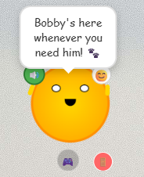

# 🤖 Bobby AI Desktop Pet

> A delightful desktop companion that brings personality to your workspace


## ✨ What is Bobby?

Bobby is an interactive AI desktop pet that lives on your computer desktop! Unlike browser-based pets, Bobby has complete freedom to roam around your screen, tell jokes, play games, and be your coding companion.

## 🎯 Features

- 🖥️ **True Desktop Freedom**: Bobby moves anywhere on your screen, not confined to a browser window
- 💬 **Personality System**: 100+ unique responses with contextual humor and dad jokes
- 🎮 **Interactive Games**: Built-in number guessing game with hints and celebrations
- 😊 **Dynamic Mood System**: Bobby's mood affects his appearance and responses
- 🎨 **Smooth Animations**: 60fps animations powered by Anime.js
- 🕶️ **Fun Surprises**: Sunglasses mode, particle effects, and Easter eggs
- 🖱️ **Smart Interactions**: Drag responses, click counting, and anti-spam features
- 💾 **Lightweight**: Small footprint, runs efficiently in the background

## 🚀 Quick Start

### Download & Run (Recommended)
1. Go to **[Releases](../../releases)** and download the latest version for your OS
2. Extract the downloaded file
3. Run `Bobby.exe` (Windows), `Bobby.app` (macOS), or `Bobby.AppImage` (Linux)
4. Meet your new desktop companion!

### Build from Source
```bash
# Clone the repository
git clone https://github.com/Dhafer99/VirtualDesktopPet.git
cd VirtualDesktopPet

# Install dependencies
npm install

# Run in development mode
npm start

# Build for production
npm run build
```

## 🎮 How to Interact with Bobby

| Action | Bobby's Response |
|--------|------------------|
| **Single Click** | Random jokes, reactions, and personality responses |
| **Double Click** | Excited responses + 30% chance for sunglasses mode |
| **Drag Around** | Movement reactions (gets annoyed if overdone!) |
| **Game Button (🎮)** | Starts interactive number guessing game |
| **Chat Button** | Open chat interface for conversations |
| **Sound Button (🔊)** | Toggle sound effects |

## 🛠️ Technical Details

- **Framework**: Electron.js for cross-platform desktop applications
- **Frontend**: Vanilla JavaScript (ES6+), HTML5, CSS3
- **Animations**: Anime.js for smooth 60fps animations
- **Architecture**: Event-driven with centralized state management
- **File Structure**: Single HTML file with embedded CSS/JS for simplicity

## 📱 Screenshots



*Bobby in action - your delightful desktop companion!*

## 🏗️ Development

### Project Structure
```
bobby-ai-pet/
├── index.html          # Main application file
├── main.js             # Electron main process
├── preload.js          # Electron preload script
├── package.json        # Dependencies and build config
├── style.css           # Styling (embedded in index.html)
└── README.md           # This file
```

### Building Releases
```bash
# Install electron-builder globally
npm install -g electron-builder

# Build for current platform
npm run dist

# Build for all platforms
npm run dist-all
```

## 🎯 Why Bobby?

This project demonstrates:
- **Cross-platform desktop development** with Electron
- **Interactive user experience** design principles
- **State management** in real-time applications
- **Animation systems** and smooth performance
- **Personality-driven programming** and user engagement

Perfect for portfolios, demonstrations, and showcasing creative coding skills!

## 🤝 Contributing

Bobby is a fun project and I welcome creative contributions! Feel free to:
- Submit bug reports or feature requests
- Propose new personality responses or interactions
- Suggest technical improvements
- Share screenshots of Bobby in action

## 📄 License

MIT License - Feel free to use Bobby as inspiration for your own desktop pet projects!

## 🎊 Future Ideas

- [ ] Machine learning for adaptive personality based on user behavior
- [ ] Multiple pet types (cat, dog, robot variants)
- [ ] Cloud sync for settings and personality customization
- [ ] Voice commands and speech synthesis
- [ ] Integration with system notifications
- [ ] Mini-games expansion pack
- [ ] Theme system with different visual styles

---

**Built with ❤️ and lots of coffee**  
*Making desktop computing more delightful, one pixel at a time*

### 🌟 Show your support
If you enjoyed Bobby, please give this repository a star! It helps others discover this fun project.


